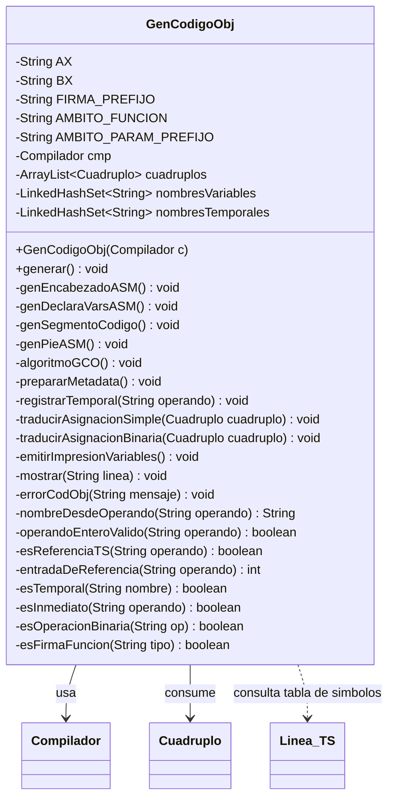

# Diseño UML de `GenCodigoObj`

Este documento contiene el diseño UML de la clase `GenCodigoObj`, correspondiente a la etapa de **Generación de Código Objeto** del compilador PaytonTK.

`GenCodigoObj` es la clase responsable de traducir la tabla de cuádruplos a código objeto en ensamblador. Consume los cuádruplos generados previamente, identifica variables y temporales, emite la plantilla ASM y traduce asignaciones simples y operaciones binarias al subconjunto soportado.

## Diagrama UML

## Responsabilidad de la clase

La clase `GenCodigoObj` realiza las siguientes tareas principales:

- asegura que existan cuádruplos antes de generar ASM;
- obtiene la lista de cuádruplos desde `cmp.cua`;
- prepara variables y temporales que serán declarados en `.data`;
- genera el encabezado y cierre del programa ensamblador;
- traduce cuádruplos de asignación simple;
- traduce cuádruplos de operaciones binarias `+`, `-` y `*`;
- envía cada línea de ASM a la interfaz por medio de `iuListener`.
