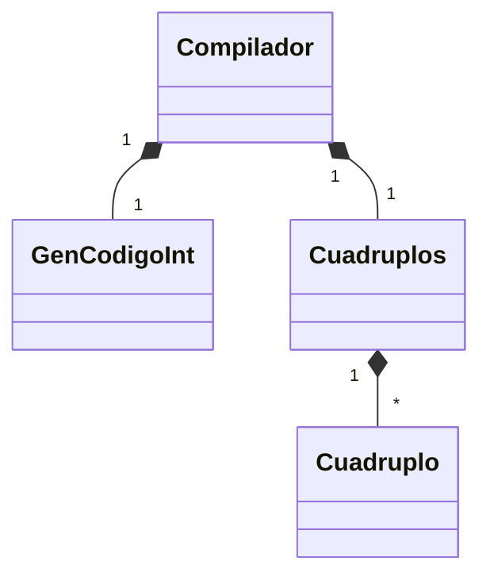
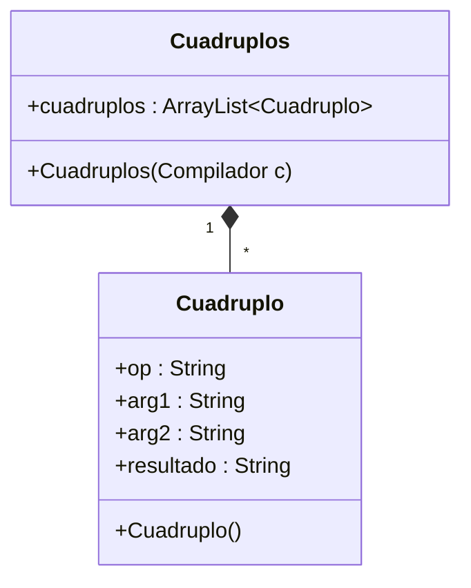

# Generación de Código Objeto

## 4.1 Introducción

La tarea final de un compilador es la de generar código ejecutable para una máquina objetivo que sea una fiel representación de la semántica del código fuente. La generación de código es la fase más compleja de un compilador, puesto que no sólo depende de las características del lenguaje fuente sino también de contar con información detallada acerca de la arquitectura objetivo, la estructura del ambiente de ejecución y el sistema operativo que esté corriendo en la máquina objetivo. La generación de código por lo regular implica también algún intento por **optimizar**, o mejorar, la velocidad y el tamaño del código objetivo recolectando más información acerca del programa fuente y adecuando el código generado para sacar ventaja de las características especiales de la máquina objetivo, tales como registros, modos de direccionamiento, distribución y memoria caché. Debido a la complejidad de la generación del código, un compilador por lo regular divide esta fase en varios pasos los cuales involucran varias estructuras de datos intermedias, y a menudo incluyen alguna forma de código abstracto denominada **código intermedio**. Un compilador también puede detener en breve la generación de código ejecutable real pero, en vez de esto genera alguna forma de código ensamblador que debe ser procesado adicionalmente por un ensamblador, un ligador y un cargador, los cuales pueden ser proporcionados por el sistema operativo o compactados con el compilador.

Nos concentraremos únicamente en los fundamentos de la generación del código intermedio y el código ensamblador, los cuales tienen muchas características en común. Ignoraremos el problema del procesamiento adicional del código ensamblador en código ejecutable, el cual puede ser controlado más adecuadamente mediante un traductor de ensamblador.

## 4.2 Implantación de C3D mediante cuádruplos

Una proposición de tres direcciones es una forma abstracta de código intermedio. En un compilador, estas proposiciones se pueden implantar como registros con campos para el operador y los operandos. Tres de dichas representaciones son cuádruplos, triples y triples indirectos.

### Cuádruplos

Un cuádruplo es una estructura tipo registro con cuatro campos, que se llamarán `op`, `arg1`, `arg2` y `resultado`. El campo `op` contiene un código interno para el operador. La proposición de tres direcciones `x := y op z` se representa poniendo `y` en `arg1`, `z` en `arg2` y `x` en `resultado`. Las proposiciones con operadores unarios como `x := -y` o `x := y` no utilizan `arg2`. Los operadores como `param` no utilizan `arg2` ni `resultado`. Los saltos condicionales e incondicionales ponen la etiqueta objeto en `resultado`. Los cuádruplos de la figura 8.8(a) corresponden a la asignación:

```txt
a := b * -c + b * -c
```

Se obtienen a partir del código de tres direcciones siguiente:

```txt
t1 := -c
t2 := b*t1
t3 := -c
t4 := b * t3
t5 := t2 + t4
a := t5
```

Los contenidos de los campos `arg1`, `arg2` y `resultado` son generalmente apuntadores a las entradas de la tabla de símbolos correspondientes a los nombres representados por dichos campos. En ese caso, los nombres temporales se deben introducir en la tabla de símbolos conforme van siendo creados.

### Fig. 8.8. Representaciones por medio de cuádruplos y triples de proposiciones de tres direcciones

#### (a) Cuádruplos

| No. | op     | arg1 | arg2 | resultado |
|---:|--------|------|------|-----------|
| (0) | menosu | c    |      | t1        |
| (1) | *      | b    | t1   | t2        |
| (2) | menosu | c    |      | t3        |
| (3) | *      | b    | t3   | t4        |
| (4) | +      | t2   | t4   | t5        |
| (5) | :=     | t5   |      | a         |

#### (b) Triples

| No. | op      | arg1 | arg2 |
|---:|---------|------|------|
| (0) | menosu  | c    |      |
| (1) | *       | b    | (0)  |
| (2) | menosu  | c    |      |
| (3) | *       | b    | (2)  |
| (4) | +       | (1)  | (3)  |
| (5) | asigna  | a    | (4)  |

## Estructura de clases





## Ejemplo de representación de un C3D en un objeto de la clase Cuadruplos

Considere el siguiente C3D

```txt
        if a > b goto etiq1
        goto etiq2
etiq1:  t1 := a + b
        b := t1
etiq2:
```

Su representación en una tabla de Cuadruplos sería:

| op   | arg1 | arg2 | resultado |
|------|------|------|-----------|
| >    | [1]  | [2]  | etiq1     |
| goto |      |      | etiq2     |
|      |      |      | etiq1     |
| +    | [1]  | [2]  | t1        |
| :=   | t1   |      | [2]       |
|      |      |      | etiq2     |

## Ejemplo de transformación a código ensamblador

```asm
        mov     ax, a
        mov     bx, b
        cmp     ax, bx
        jg      etiq1      ; salta si ax es mayor que bx   j=jump g=greater than
        jmp     etiq2

etiq1:
        mov     ax, a
        mov     bx,b
        add     ax,bx
        mov     b, ax

etiq2:
```

## 4.3 Bloques básicos

Un bloque básico es una secuencia de proposiciones consecutivas en las que el flujo de control entra al principio y sale al final sin detenerse y sin posibilidad de saltar excepto al final. La siguiente secuencia de proposiciones de tres direcciones forman un bloque básico:

```txt
t1 := a * a
t2 := a * b
t3 := 2 * t2
t4 := t1 + t3
t5 := b * b
t6 := t4 + t5
```

Una proposición de tres direcciones `x := y + z` define `x` y usa ( o se refiere a ) `y` y `z`. Se dice que un nombre en un bloque básico **está activo** en un punto dado si su valor se utiliza después de ese punto en el programa, tal vez en otro bloque básico.

El siguiente algoritmo se puede utilizar para particionar en una secuencia de proposiciones de tres direcciones en bloques básicos.

### Algoritmo. Partición en bloques básicos

**Entrada.** Una secuencia de proposiciones de tres direcciones.  
**Salida.** Una lista de bloques básicos donde cada proposición de tres direcciones está en un bloque exactamente.

### Método

1. Primero se determina el conjunto de líderes, la primera proposición de cada bloque básico. Las reglas que se utilizan son las siguientes:
   1. La primer proposición es un líder.
   2. Cualquier proposición que sea el destino de un salto `goto` condicional o incondicional es un líder.
   3. Cualquier proposición que vaya inmediatamente después de un salto `goto` condicional o incondicional es un líder.
2. Para cada líder, su bloque básico consta del líder y de todas las proposiciones hasta, pero sin incluirlo, el siguiente líder o el fin del programa.

Ahora se aplica el algoritmo al código de tres direcciones de la figura siguiente para determinar sus bloques básicos. La proposición (1) es un líder según la regla i) y la proposición (3) es un líder según la regla ii), puesto que la última proposición puede saltar a ella. Según la regla iii), la proposición que sigue a (12) es un líder.

```txt
(1)     prod := 0
(2)     i := 1
(3)     t1 := 4 * i
(4)     t2 := a [ t1 ]      /* calcula a[i] */
(5)     t3 := 4 * i
(6)     t4 := b [ t3 ]      /* calcula b[i] */
(7)     t5 := t2 * t4
(8)     t6 := prod + t5
(9)     prod := t6
(10)    t7 := i + 1
(11)    i := t7
(12)    if i <=goto (3)
```

Las proposiciones (1) y (2) forman un bloque básico. El resto del programa comenzando en la proposición (3), forman un segundo bloque básico.

## 4.4 Generación de Código Objeto

### 4.4.1 Descriptores de registros y direcciones

El algoritmo de generación de código utiliza descriptores para seguir de cerca el contenido de los registros y las direcciones para los nombres.

1. Un descriptor de registros sabe lo que hay en cada registro. Es consultado siempre que se necesite un nuevo registro. Se supone que inicialmente el descriptor de registros muestra que todos los registros están vacíos. (si los registros se asignan entre los bloques, este no sería el caso.) Conforme avanza la generación de código para el bloque, cada registro contiene siempre el valor de cero o más nombres.

2. Un descriptor de direcciones conoce la posición (o posiciones) donde se puede encontrar el valor en curso del nombre durante la ejecución. La posición puede ser un registro, una posición en la pila, una dirección de memoria o conjunto de éstos porque cuando se copia, un valor también permanece donde estaba. Esta información se puede almacenar en la tabla de símbolos y se utiliza para determinar el método de acceso a un nombre.

### 4.4.2 Información sobre el siguiente uso

En esta sección se reúne la información del siguiente uso sobre nombres en los bloques básicos. Si ya no se necesita el nombre en un registro, entonces el registro se puede asignar a algún otro nombre. Esta idea de conservar un nombre en memoria, sólo si va a utilizarse posteriormente, se puede aplicar en varios contextos. El generador de código simple de la siguiente sección la aplica a la asignación de registros. Como última aplicación, se considera la asignación de memoria para nombres temporales.

#### Cálculo de los siguientes usos

El uso de un nombre en una proposición de tres direcciones se define de la siguiente manera. Supóngase que la proposición de tres direcciones `j` asigna un valor a `x`. Si la proposición `i` tiene a `x` como un operando y el control puede fluir de la proposición `i` a la `j` por un camino que no tiene asignaciones intermedias a `x`, entonces se dice que la proposición `j` usa el valor de `x` en `i`.

Se desea determinar para cada proposición de tres direcciones `x := y op z` cuáles son los siguientes usos de `x`, `y` y `z`. Por el momento, no interesan los usos fuera del bloque básico que contiene esta proposición de tres direcciones pero se puede intentar determinar si existe uso mediante la técnica de análisis de variables activas.

El algoritmo que aquí se presenta para determinar los usos siguientes realiza una pasada hacia atrás sobre cada bloque básico. Se puede examinar fácilmente una cadena de proposiciones de tres direcciones para encontrar los finales de los bloques básicos. Como los procedimientos pueden tener efectos secundarios arbitrarios, se supone por conveniencia que cada llamada a un procedimiento inicia un bloque básico.

Habiendo encontrado el final de cada bloque básico, se inspecciona hacia atrás hasta el comienzo, registrando (en la tabla de símbolos) para cada nombre `x` si `x` tiene o no un siguiente uso en el bloque y si no lo tiene, indicando si está activo a la salida de ese bloque. Si se ha hecho el análisis del flujo de datos que se presenta en el capítulo 10 del libro, se sabe qué nombres están activos a la salida de cada bloque. Si no se ha hecho el análisis de variables activas se puede suponer que todas las variables no temporales están activas a la salida. Si los algoritmos que generan el código intermedio o que optimizan el código permiten que ciertos temporales se utilicen a través de bloques, éstos también se deben considerar activos. Sería buena idea marcar dichos temporales, de modo que no haya que considerar activos todos los temporales.

Supóngase que se alcanza la proposición de tres direcciones `i: x := y op z` en el examen hacia atrás. Entonces se hace lo siguiente:

1. Se asocia a la proposición `i` la información encontrada en la tabla de símbolos relativa al siguiente uso y actividad de `x`, `y` y `z`.

2. En la tabla de símbolos, se asigna a `x` “no activo” y “sin uso siguiente”.

3. En la tabla de símbolos, se indica que `y` y `z` están “activos” y se igualan los siguientes usos `y` y `z` a `i`. Obsérvese que no se puede intercambiar el orden de los pasos 2 y 3 porque `x` puede ser `y` o `z`.

Si la proposición de tres direcciones `i` es de la forma `x = y` o `x := op y`, los pasos son los mismo que antes, sin tener en cuenta `z`.

Ejemplo: información sobre el siguiente uso.

```txt
t1 := a * a
t2 := a * b
t3 := 2 * t2
t4 := t1 + t3
t5 := b * b
t6 := t4 + t5
```

| No. Prop. | Bloque | Proposición   | arg1 Sig.Uso | arg1 Activo | arg2 Sig.Uso | arg2 Activo | resultado Sig.Uso | resultado Activo |
|---:|--------|---------------|:------------:|:-----------:|:------------:|:-----------:|:-----------------:|:----------------:|
| 1 | B1 | t1 := a * a  | 2 | S | 2 | S | 4 | S |
| 2 |    | t2 := a * b  | X | S | 5 | S | 3 | S |
| 3 |    | t3 := 2 * t2 | - | - | X | S | 4 | S |
| 4 |    | t4 := t1 + t3| X | S | X | S | 6 | S |
| 5 |    | t5 := b * b  | X | S | X | S | 6 | S |
| 6 |    | t6 := t4 + t5| X | S | X | S | X | S |

**X = Sin uso siguiente**

#### Tabla de Símbolos

| Lexema | SigUso 1 | SigUso 2 | SigUso 3 | Activo 1 | Activo 2 | Activo 3 |
|--------|:--------:|:--------:|:--------:|:--------:|:--------:|:--------:|
| a  | X | 2 | 1 | S | S | S |
| b  | X | 5 | 2 | S | S | S |
| t1 | X | 4 | X | S | S | N |
| t2 | X | 3 | X | S | S | N |
| t3 | X | 4 | X | S | S | N |
| t4 | X | 6 | X | S | S | N |
| t5 | X | 6 | X | S | S | N |
| t6 | X | N |   | S | N |   |

**X = Sin uso siguiente**

La información de siguiente uso y actividad que aparece en la Tabla de Símbolos representa la historia de valores que fue tomando cada lexema. El valor de más a la derecha es el valor más actual.

### 4.4.3 Un algoritmo para la generación de código

Inicialmente todos los descriptores de registro se muestran vacíos y los descriptores de direcciones muestran como única ubicación su propia posición de memoria.

El algoritmo para la generación de código toma como entrada una secuencia de proposiciones de tres direcciones que constituyen un bloque básico. A continuación se presentan los algoritmos de traducción para proposiciones de asignación, salto condicional y salto incondicional.

#### a. PROPOSICIONES DE ASIGNACION

Para cada proposición de tres direcciones de la forma

```txt
x := y op z
```

se realizan las siguientes operaciones:

1. Se invoca la función *obtenreg* para determinar la posición `L` donde se debe guardar el resultado del cálculo `y op z`. Generalmente `L` será un registro, pero también puede ser una posición de memoria. Dentro de poco se descubrirá *obtenreg*.

2. Se consulta el descriptor de direcciones de `y` para determinar `y'`, (una de) la(s) posición(es) en curso de `y`. Se prefiere un registro para `y'` si el valor de `y` está en ese momento en memoria y un registro. Si el valor de `y` no está todavía en `L` se genera la instrucción `MOV L, y'` para colocar una copia de `y` en `L`, se modifica el descriptor de registro de `L` de manera que **solo** contiene a `y` y se cambia el descriptor de direcciones de `y` agregando el registro `L` como ubicación adicional.

3. Se genera la instrucción `OP L, z'` donde `z'` es una posición en curso de `z`. De nuevo, se prefiere un registro a una posición de memoria si `z` se encuentra en ambos. Se actualiza el descriptor de direcciones de `x` para indicar que `x` está únicamente en la posición `L`. Si `L` es un registro, se actualiza su descriptor para indicar que **únicamente** contiene el valor de `x`, se elimina `x` de todos los otros descriptores de registros y se elimina `L` del descriptor de direcciones de cualquier otra variable que no sea `x`.

4. Si los valores en curso de `y` o `z`, o ambos, no tienen usos siguientes, no están activos a la salida del bloque y están en registros, se altera el descriptor de registros para indicar que después de la ejecución de `x := y op z`, estos registros ya no contendrán `y` o `z`, o ambos, respectivamente.

Si la proposición de tres direcciones en curso tiene un operador unario, los pasos son análogos a los anteriores, y se omiten detalles. Un caso especial importante es una proposición de tres direcciones `x := y`. Si `y` está en un registro:

a) Se agrega `x` al descriptor de registro asignado a `y`.  
b) Se cambia el descriptor de direcciones de `x` de manera que su única ubicación es el registro asignado a `y`.

si `y` no tiene uso siguiente y no está activo a la salida de un bloque, el registro ya no contiene el valor de `y`.

Si `y` sólo se encuentra en memoria, en principio se podría hacer constar que el valor de `x` está en la posición de `y`, pero esta opción complicaría el algoritmo, porque entonces no se podría modificar el valor de `y` sin preservar el valor de `x`. Por tanto, si se encuentra en memoria, se utiliza *obtenreg* para encontrar un registro en el que cargar `y` mediante una instrucción `MOV L, y` y convertir ese registro en la posición de `x` (es decir se modifica el descriptor de registro de `L` para agregar `y` y `x`, se modifica el descriptor de `x` para indicar que solo se encuentra en `L`), se elimina a `x` de todos los otros descriptores de registro.

#### b. PROPOSICIONES DE SALTO CONDICIONAL

Para cada proposición de tres direcciones de la forma

```txt
if y op z goto E
```

se realizan las siguientes operaciones:

i. Se consulta el descriptor de direcciones de `y` para determinar `y'`, (una de) la(s) posición(es) en curso de `y`, se prefiere un registro para `y'` y si es así se asigna dicho registro a `L`. Si el valor de `y` solo está en memoria invoque *obtenreg* para obtener `L` y genere la instrucción `MOV L, y'` para colocar una copia de `y` en `L`, se modifica el descriptor de registro de `L` de manera que solo contiene a `y` y se cambia el descriptor de direcciones de `y` agregando el registro `L` como ubicación adicional.

ii. Se genera la instrucción `cmp L, z'` donde `z'` es una posición en curso de `z`. De nuevo, se prefiere un registro a una posición de memoria si `z` se encuentra en ambos.

iii. Se genera la instrucción `jOP E` que es un salto condicionado al resultado de la comparación generada en el paso anterior, la instrucción dependerá del operador de comparación `op`. Únicamente para propósitos ilustrativos podría considerarse las siguientes equivalencias:

| OP | Instrucción |
|----|-------------|
| == | je  |
| >  | jg  |
| >= | jge |
| <  | jl  |
| <= | jle |
| != | jne |

#### c. PROPOSICIONES DE SALTO INCONDICIONAL

Para cada proposición de tres direcciones de la forma

```txt
goto E
```

simplemente sustituyase por la instrucción

```asm
jmp E
```

## FUNCION OBTENREG

La función *obtenreg* devuelve la posición `L` para guardar el valor de `x` para la asignación `x := y op z`.

1. Si el nombre `y` está en un registro que no contiene el valor de otros nombres ( recuérdese que las instrucciones de copia como `x := y` podrían hacer que un registro guardara el valor de dos o más variables simultáneamente ) entonces se devuelve el registro de `y` para `L`.

2. Si falla (1), devuélvase un registro vacío para `L` si hay alguno.

3. Si falla (2), si `x` tiene un uso siguiente en el bloque u `op` es un operador, como indizar, que exige un registro, encuéntrese un registro ocupado `R`. Almacénese el valor de `R` en una posición de memoria ( mediante `MOV M, R` ) si es que todavía no está en una posición de memoria apropiada `M`, actualícese el descriptor de direcciones de `M` y devuélvase `R`. Si `R` contiene el valor de varias variables, se debe generar una instrucción `MOV` para cada variable que haya que almacenar. Un registro ocupado adecuado puede ser uno cuyo dato sea el referenciado más lejos en el futuro, o uno cuyo valor también esté en memoria. No se especifica la opción exacta porque no se conoce mejor forma de hacer la selección.

4. Si no se utiliza `x` en el bloque, o no se puede encontrar ningún registro ocupado adecuado, selecciónese la posición de memoria `x` como `L`.

## FINALIZACION DE UN BLOQUE BASICO CUANDO LA ULTIMA PROPOSICION NO ES UN SALTO

Las variables usadas por el bloque pueden acabar en un registro como su única ubicación. Si la variable es temporal (t1, t2, etc.) usada solo dentro del bloque todo está bien; cuando el bloque termina, podemos olvidarnos de su valor y asumir que su registro está vacío. Sin embargo, si la variable está activa a la salida del bloque, o si desconocemos cuales variables están activas a la salida, entonces necesitamos asumir que el valor de la variable es necesariamente posteriormente. En este caso, por cada variable `x` cuyo descriptor no diga que su valor está ubicado en la posición de memoria para `x`, debemos generar la instrucción `MOV x, R` donde `R` es un registro en el que el valor de `x` existe al final del bloque solo si el descriptor de registros de `R` confirma que contiene a `x`, luego modifique el descriptor de direcciones de `x` para incluir su propia ubicación de memoria.

Finalmente limpie todos los descriptores de registro eliminando además todos los registros de los descriptores de direcciones.

## FINALIZACION DE UN BLOQUE BASICO CUANDO LA ULTIMA PROPOSICION ES UN SALTO

Si la última proposición del bloque básico es un salto condicional o incondicional debe aplicarse la finalización de bloque básico **ANTES** de traducir la proposición de salto. Por cada variable no-temporal `x` cuyo descriptor no diga que su valor está ubicado en la posición de memoria para `x`, debemos generar la instrucción `MOV x, R` donde `R` es un registro en el que el valor de `x` existe al final del bloque solo si el descriptor de registros de `R` confirma que contiene a `x`, luego modifique el descriptor de direcciones de `x` para incluir su propia ubicación de memoria.

Después de actualizar las posiciones de memoria de todas las variables traduzca la instrucción de salto. Finalmente limpie todos los descriptores de registro eliminando además todos los registros de los descriptores de direcciones.

## EJERCICIO

Usando el algoritmo de generación de código anterior producir el código objeto para el siguiente código de 3 direcciones:

```txt
        a:= d
etiq1:  t1 := a - b
        t2 := a - c
        t3 := t1 + t2
        d := t3 + t2
        if d > 0 goto etiq1
        goto etiq2
etiq2:  d := b + 1
```

En este ejemplo se asume que todas las variables están activas a la salida de cada bloque.

El análisis debe mostrar el estado de:

1. Cuádruplos con información de siguientes usos.
2. Tabla de Símbolos.
3. Descriptores de registros y direcciones.
4. Variables auxiliares `L`, `y'` y `z'` que usa el algoritmo.

Los descriptores de registros y direcciones son estructuras de listas, de manera que un descriptor puede tener varios valores almacenados, un valor tachado o coloreado significa que ese valor estuvo en el descriptor pero que se eliminó en algún paso del algoritmo.

En la Tabla de Símbolos la columna **SigUso** no es una estructura de lista sino un dato simple, lo mismo que las variables auxiliares `L`, `y'` y `z'`.

Finalmente dado que el algoritmo esta dado en términos de la proposición genérica de 3 direcciones `x := y op z` la tabla del código objeto indica para cada proposición de 3 direcciones quién es `x`, `y` y `z` respectivamente.
